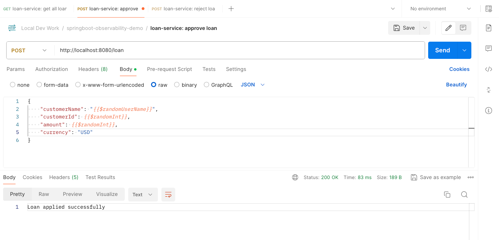

# Springboot Observability Demo

## Overview

This demo project includes 2 **springboot** microservices: `loan-service` and `fraud-detection-service`.

When a loan creation request is received from a customer, `loan-service` will make a call to `fraud-detection-service` and verify that this customer is not included in a known fraud lists maintained in a **MySQL** database.


Observability tools like **Grafana**, **Prometheus**, **Tempo**,  **Loki**, and **Micrometer** are used for instrumentation and telemetry purposes.


## Terminology

- **Observability**: Ability to understand, monitor, and debug the internal state and behavior of applications through different indicators (such as metrics, logs, traces).
- **Instrumentation**: Instrumenting a code path involves adding monitoring and logging mechanisms within the code to collect data about its execution and behavior. This process typically involves inserting additional code (**instrumentation**) into the application's source code at strategic points to gather relevant information.
- **Telemetry**: Automated collection and transmission of data from a system's various components to a centralized location for analysis and monitoring. Telemetry data typically includes metrics, logs, traces, and events generated by the system.
- **Metrics**: Gathering quantitative data about the system's performance, such as response times, error rates, throughput, and resource utilization.
- **Logs**: Capturing and analyzing log messages generated by various components of the system to provide insights into its behavior, including errors, warnings, and informational events.
- **Tracing**: Tracing the flow of requests through the system across multiple components and services, enabling developers to identify performance bottlenecks, latency issues, and dependencies.
- **Distributed Context**: Propagating contextual information (such as request IDs, user IDs, and transaction IDs) across distributed components to facilitate correlation and troubleshooting of distributed transactions.
- **Events**: Capturing and analyzing significant events and changes in the system, such as deployments, configuration changes, and security-related events.
- **Visualizations**: Presenting the collected data in a meaningful and intuitive manner, often through dashboards, graphs, and charts, to enable developers and operators to quickly understand the system's behavior.
- **Alerts**: Setting up alerts and notifications to promptly notify developers and operators about abnormal or unexpected behavior in the system, allowing them to take proactive action.
- **Debugging Tools**: Providing developers with tools and capabilities for debugging and diagnosing issues in the system, such as interactive debugging, profiling, and performance monitoring.
- **Aspect-Oriented Programming (AOP)**: AOP is an approach to programming that allows global properties of a program to determine how it is compiled into an executable program. An aspect is a subprogram that is associated with a specific property of a program (i.e. a common behavior that's typically scattered across methods, classes, object hierarchies, or even entire object models.). AOP extends the traditional Object-Oriented Programming (OOP) model to improve code reuse across different object hierarchies. AOP focuses on the separation of concerns while traditional OOP (Object-oriented programming) focuses on the encapsulation of data and behavior into objects. 

## Tech Stack

- **Java** 21
- **Springboot** 3.2.4: Java web application framework.
- **Maven** 3.9.6: Java dependency manager and build tool.
- **Lombok**: Java annotation library to reduce boilerplate code.
- **spring-boot-starter-aop**: Maven dependency to enable Aspect Oriented Programming (AOP). 

- **Grafana**: Tool to visualize and monitor metrics, logs, traces etc. This brings all services like Tempo, Loki, and Prometheus together to visualize their  information. The `docker/grafana/datasource.yml` file defines data sources from which Grafana needs to gather data to visualize.

###### Logging
- **Logback**: Java logging library.
- **loki-logback-appender**: Logback log appender for Grafana Loki. `resources/logback-spring.xml` file includes how the Logback appender should structure logs and where to send them (i.e. Loki URL).
- **RestTemplate Spring Bean**: Provides a high-level API over HTTP client libraries. It can implement efficient request/response logging capability with metrics and traces, which can be used to debug exchange between two servers. e.g. As we are using a RestTemplate to call origin service from destination service, the traceId and spanId are generated and propagated automatically.
- **[Grafana Loki](https://grafana.com/oss/loki/)**: Tool to aggregate and index logs to be visualized using Grafana.

###### Tracing
- **Micrometer**: Code instrumentation tool with a vendor-neutral tracing facade (a.k.a. tracing bridge) support for collecting, preparing, and sending metrics and traces to aggregators like Prometheus. Available tracing bridge implementations include **micrometer-tracing-bridge-brave** for Brave and **micrometer-tracing-bridge-otel** for OpenTelemetry formats.
- **micrometer-tracing-bridge-brave**: Maven dependency to add distributed tracing capabilities for application using Micrometer. 
- **datasource-micrometer-spring-boot**: Maven dependency to use Micrometer and trace calls to the database from Spring Data JDBC.
- **zipkin-reporter-brave**: Maven dependency to export tracing information to Tempo.
- **[Brave](https://github.com/openzipkin/brave)** — Distributed tracing instrumentation library supporting both W3C & B3 trace context and propagation formats and main compatible with Zipkin backend services (also supporting [Amazon X-Ray](https://github.com/openzipkin/zipkin-aws/tree/master/storage/xray-udp) and other services using third-party plugins).
- **[Zipkin](https://github.com/openzipkin/zipkin)** — Distributed tracing tool for visualizing, monitoring, and troubleshooting distributed traces in service architectures.
- **[Grafana Tempo](https://grafana.com/oss/tempo/)**: Distributed tracing backend, deeply integrated with Grafana, Prometheus, and Loki. Tempo can ingest common open source tracing protocols, including Jaeger, Zipkin, and OpenTelemetry. Tempo configurations can be specified in `docker/tempo/tempo.yml` file.

###### Metrics
- **spring-boot-starter-actuator**: Maven dependency to collect metrics of our application such as JVM statistics, Thread Count, Heap Memory information, etc. Metrics supported by Springboot Actuator can be found here: https://docs.spring.io/spring-boot/docs/current/reference/html/actuator.html#actuator.metrics.supported.
- **micrometer-registry-prometheus**: Maven dependency to enable Micrometer (e.g. at runtime) and expose an endpoint that can be scraped by metric aggregators like Prometheus.
- **Prometheus**: Tool to aggregate metrics. It expects a configurations file that specifies where to scrape metrics etc.: `docker/prometheus/prometheus.yml`

###### Database
- **MySQL**: Relational database.
- **JDBC**: Java API to connect and execute queries with a relational database (e.g. MySQL).
- **Flyway**: Tool to run database migrations.
- **datasource-micrometer-spring-boot**: Maven dependency to trace database calls (using Spring Data JDBC).


## Observability Configurations

On `resources/application.properties` file:
- `management.endpoints.web.exposure.include=health, info, metrics, prometheus`: exposes the endpoints health, info, metrics, and prometheus through springboot actuator.
- `management.metrics.distribution.percentiles-histogram.http.server.requests=true`: instruct micrometer to gather the metrics in the form of a histogram and send it to Prometheus. Read more: https://micrometer.io/docs/concepts#_histograms_and_percentiles
- `management.tracing.sampling.probability=1.0`: instruct micrometer to send 100% (= 1.0) of the traces it generates to Tempo. By default, Micrometer Tracing will only send 10% (= 0.1) of the traces it generates to Tempo to avoid overwhelming it with a lot of requests.

## Initial Setup

The 2 main services were initialized as a fresh project with Springboot Web dependency (https://start.spring.io/). 

``` 
Project: Maven
Language: Java
Springboot version: 3.2.4
Group: demo.services
Name: loan-service
Artifact: loan-service
Packaging: Jar
Java version: 21
Dependencies: spring-boot-starter-web, lombok
```

Then, extract fresh project and clean up unnecessary files.

```
rm -rf .mvn mvnw mvnw.cmd HELP.md
```

Develop project files, docker files, config files etc.

For services to work, first start docker containers for enabling access to database and observability components.

```
docker-compose up -d
```

Docker containers will run on below ports.

``` 
MySQL: localhost:3316
Grafana: http://localhost:3000
Prometheus: http://localhost:9090
Tempo: http://localhost:3110
Loki: http://localhost:3100
```

Optionally, log into MySQL.

``` 
mysql -u root -p
    > password: mysql
    
mysql -u root -pmysql
```

Build services.

```
pushd services/fraud-detection-service
mvn clean install
popd

pushd services/loan-service
mvn clean install
popd
```

To run and debug the application, go to the main class of fraud-detection-service (`FraudDetectionServiceApplication.java`) and run it in debug mode using IDE. Repeat the same for loan-service main class (`LoanServiceApplication.java`) as well.

During the application startup, database tables (`src/main/resources/db/migration/V1__create_tables.sql`) and test data (`src/main/resources/data.sql`) will be created from resources files.

Now make some calls to `GET/loan` and `POST/loan` endpoints using a tool like `cURL` or Postman (import from `springboot-observability-demo.postman_collection.json`).

``` 
# GET/loan | loan-service: get all loans
curl --location 'http://localhost:8080/loan'

# POST/loan | loan-service: approve loan 
curl --location 'http://localhost:8080/loan' \
--header 'Content-Type: application/json' \
--data '{
    "customerName": "{{$randomUserName}}",
    "customerId": {{$randomInt}},
    "amount": {{$randomInt}},
    "currency": "USD"
}'
```



Navigate to Grafana dashboard via `http://localhost:3000` and select `Explore` from the left sidebar. Under the dropdown, select `Loki` and run a sample query (e.g. `application label` -> `loan-service`).


Switch to `Prometheus` and run the same query.


Go back to `Loki` and expand a log line to find its `TraceID`. Click on the `Tempo` button next it to open up a `Tempo` view from right side. Inspect how to loan-service has made a call to fraud-detection service and how that trace is tracked using `TraceID`.


Expand the trace in `Tempo` to inspect how loan service calls fraud-detection service, how the fraud-detection service queries MySQL database for already-known fraud users, how loan service saves the loan details to MySQL database etc.


Feel free to switch to different tab views and experiment with different queries.
